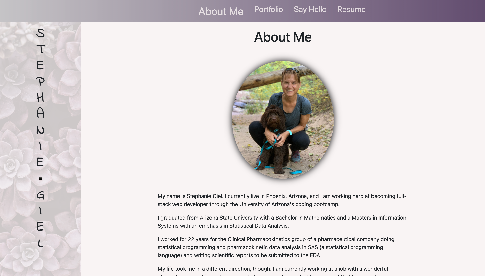
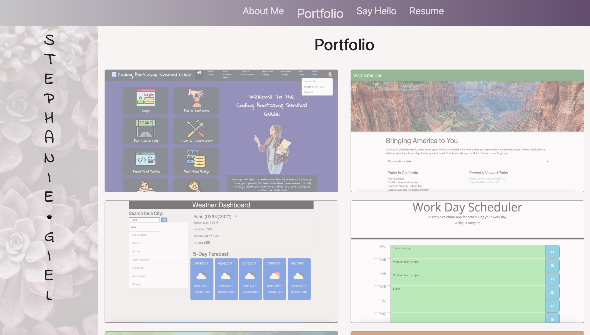
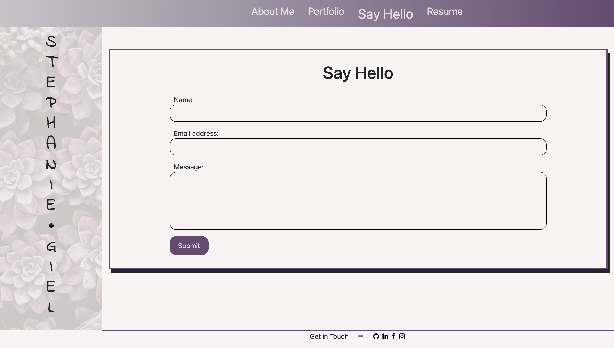
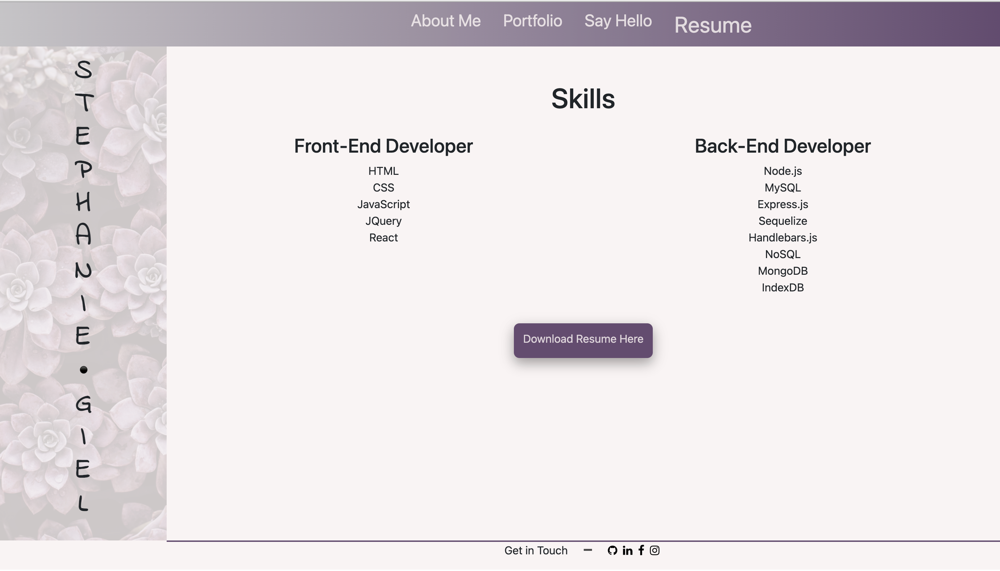

# personal-portfolio-v3 

  

    
    
    

## Assignment
  This is my personal portfolio built as a single page application with React JS. 
  
## Description
  This is a Single Page Application \(SPA\) of my personal portfolio which includes:
  -- About Me 
  -- Portfolio \(projects with links to the sites as well as links to GitHub repostories\)
  -- Say Hello \(with form to contact me\)
  -- Resume \(includes a list of my current skills as well as a downloadable resume\)

## Screenshots of web application 

## Table of Contents

* [Installation](#installation)
* [Usage](#usage)
* [Link](#link)
* [License](#license)

* * *

## Installation
  :one: Clone the repository to your terminal. 
  :two: Intall Node.js to your terminal. 
  :three: Install npm packages contained in the package.json
  :four: Type `npm start` from the root of your project's directory in the terminal window

## Usage
   This project utilizes Node.js, React, React Router, and Bootstrap. 

## Link

> [link to Stephanie' personal-portfolio-v3 webpage](https://sgiel.github.io/personal-portfolio-v3/)
 
## License  
  
This application is covered under the MIT License. You may obtain a copy of the license at the link below:

(https://opensource.org/licenses/MIT)

    
